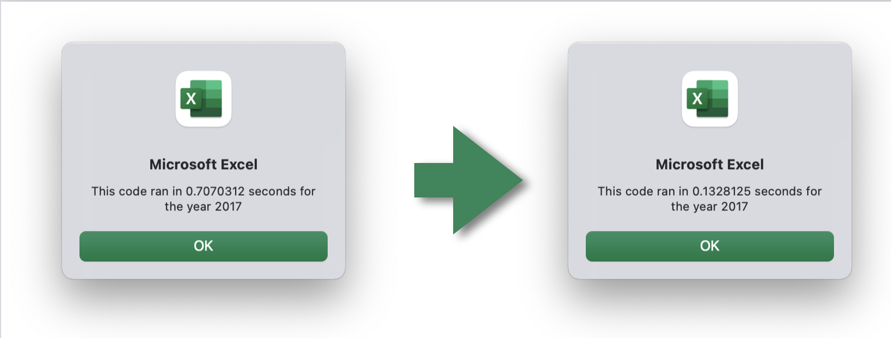
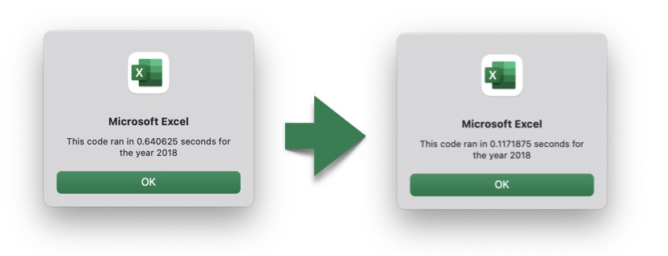

# VBA of Wall Street

## Overview of Project
Client has requested an analysis that can be performed on-demand with 12 specific stock tickers in the green energy sector.

After inital project was delivered, client wanted to have the flexability to analyize multiple tickers as needed across the entire stock market. This would require more efficient code to minimize runtime of the tool

## Results
Overall performance was improved by approximately 138% with refactored code.

The initial analysis tool needed to perfom on only 12 stock tickers, so code that was quick to develop and provided analysis in a reasonable elapsed time was developed.

The client then requested the flexibility to anlalize many more stock tickers; therefore, the code was refactored to effectively work with larger data sets with a minimized run-time.

### Original Code (left) vs Refactored Code (right) Runtimes

## Summary
The advantage of the original code is speed to develop and deliver by using simple VBA coding. The provided dataset is relatively small with only 12 stock tickers, and was performed in well under a second - an acceptable time frame.

The disadvantage of this code is working with larger and larger data sets with many more ticker symbols. Although refactoring takes a bit more time to develop and requires knowledge of more sophisticated techniques, the output is markedly faster though code that is more efficient. This will be evident when working with large datasets for multiple stock tickers, as per the client's request.
