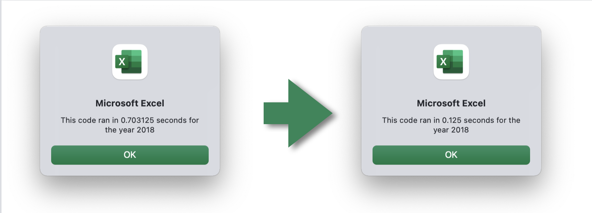

# stock-analysis
There is a title, and there are multiple paragraphs (2 pt).
Each paragraph has a heading (2 pt).
There are subheadings to break up text (2 pt).
Links are working, and images are formatted and displayed where appropriate (2 pt).

# Overview of Project
Client has requested an analysis that can be performed on-demand with stock tickers in the green energy sector.

After project was delivered, client wanted to expand the analysis tool to cover the entire stock market. This would require most efficient code to minimize runtime of the tool

# Results
The code intitially provided ran on 12 stock tickers and used coding that was quick to provide and would provide analysis in a reasonable elapsed time.

When the client wanted to run more stock tickers, and indeed the stock market in general, the code was refactored to effectively meet the client's request.

## Original Code (left) vs Refactored Code (right) Runtimes

Summary
There is a detailed statement on the advantages and disadvantages of refactoring code in general (3 pt).
There is a detailed statement on the advantages and disadvantages of the original and refactored VBA script (3 pt).
